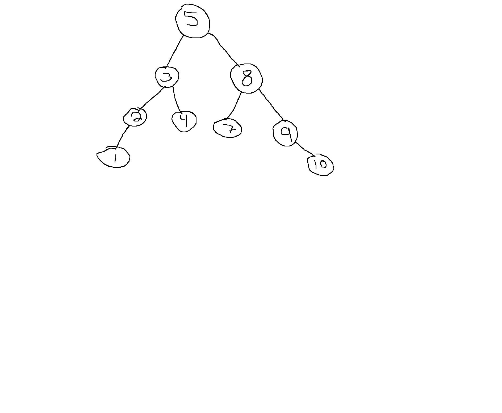

### What is a Binary Search Tree?

A binary search tree is a data structure based on a tree with a root, and left and right nodes. But, what about the binary search tree is _binary_?
The **binary** part of a Binary Search Tree, is that each node represents data smaller (the left pointer) or larger (the right pointer) as the tree is traversed from the root element.
This structure ends up making something that looks like this:


As you can see, each node will split left or right whether it is smaller or larger than the root.

Now, once you have viewed my terrible drawing, how do we implement a BST in JavaScript?

First we need to start with the trees leaves. Each leaf or node will have three properties:

1. The key, for simplicity, well use a number.
2. a left node, that will start with a value of null
3. a right node, that will also start with a value of null.

Lets implement the node in JavaScript.

```javascript
class Node {
  constructor(key) {
    this.key = key
    this.left = null
    this.right = null
  }
}
```

Our node class has a constructor that receives a number, and returns an object that represents our node.
Lets now create the class to implement our Binary Search Tree.

```javascript
class BST {
  constructor() {
    this.root = null
  }
}
```

Our BST class has a constructor that creates a root, and starts with the value of null to start with an empty tree.
Now, our BST class needs to insert items, or nodes. How do we go about that?

```javascript
  insert(key, parent = this.root) {
    let newNode = new Node(key);
    if (this.root == null) {
      return (this.root = newNode);
    }
    if (key < parent.key) {
      if (parent.left !== null) {
        this.insert(key, parent.left);
      } else {
        return (parent.left = newNode);
      }
    } else if (key > parent.key) {
      if (parent.right !== null) {
        this.insert(key, parent.right);
      } else {
        return (parent.right = newNode);
      }
    }
  }
```

The algorithm for an insert:

1. if key < parents key and the parent has a left node

   - tell the left node to try and insert our new key

2. otherwise, if the key > than the parent key and the parent has a right node

   - tell the right to try and insert the new key

3. otherwise

   - insert the key left or right depending on its relation with the parent key

Also, dont forget to check to see if the root is null!

This will be it for the BST in this blog. I will be adding to the Binary Search tree searies as I find time.
Thanks!
